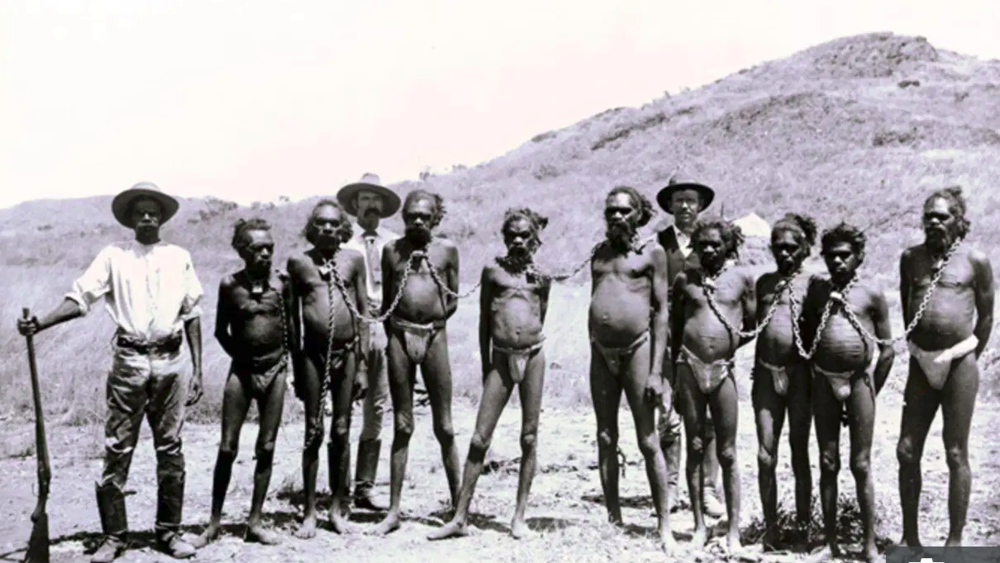
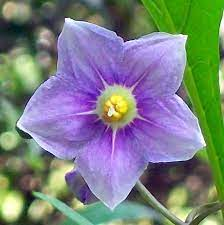
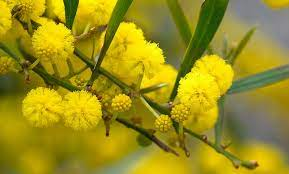
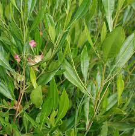

# IQ3-2

>Investigate scientists increasing awareness of the value of Aboriginal and Torres Strait Islander Peoples' knowledge and understanding of the medicinal uses of plants and, in partnership with communities, investigate the potential for ethical development of new drug treatments and synthetic chemicals through the bioharvesting of plants from Country and Place

---
# See, Think, Wonder

---
### See
---
* Slavery
* Forced Labor

### Think
---
* The conditions they are being keep in

### Wonder
---
* How hard tough the conditions were
* How humanly they were kept
---
# Activity - Aboriginal Uses of Plants as Medicines
## List 3 medicinal plants which are known by Aboriginal peoples, include images and information on their uses.

|		Plant		|		Image						|		Uses																												|
|:-----------------:|:---------------------------------:|---------------------------------------------------------------------------------------------------------------------------|
|	Kangaroo apple	|	| Achy Joints, Wounds, it also encourages skin healing from scaring, pigmentation and aging									|
|	Wattle			|			| Used to treat headaches, skin complaints, aches, pains, infections, rheumatism, colds and toothaches						|
|	Hop Bush		|		| Used to heal wounds, treat rashes, sooth insect bites and even toothaches if chewed										|

---
## Provide an outline of how `Amrad Pty Ltd` ripped off indigenous people include

### Who are Armad?

